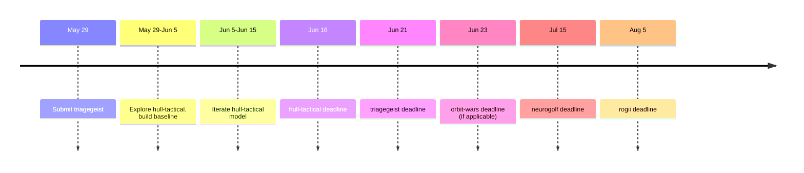

# Kaggle Competition Research — May 29, 2026

## Active Competitions (Next 60 Days)

### 1. ✅ triagegeist — $10,000 — Community
- **Deadline:** June 21, 2026 (23 days)
- **Teams:** 115 (low — good chance to rank)
- **Data:** Tabular, 80K rows, 40+ features — our HGB strength
- **Status:** ✅ Submission ready (0.8992 CV MF1), notebook written
- **Action:** Accept rules on web UI, upload CSV + notebook

### 2. 🎯 hull-tactical-market-prediction — $100,000 — Featured
- **Deadline:** June 16, 2026 (18 days)
- **Teams:** 3,677
- **Data:** Likely time-series/market data — tabular-friendly
- **Edge:** Financial prediction aligns with Bull & Bear domain expertise
- **Action:** Download data → explore → baseline model

### 3. ⏳ rogii-wellbore-geology-prediction — $50,000 — Featured
- **Deadline:** August 5, 2026 (68 days)
- **Teams:** 1,824
- **Data:** Likely tabular regression (geology wellbore data)
- **Edge:** Direct HGB/LightGBM application
- **Action:** Start after triagegeist submission

### 4. ⏳ orbit-wars — $50,000 — Featured
- **Deadline:** June 23, 2026 (25 days)
- **Teams:** 3,419
- **Action:** Check data type — may be computer vision

### 5. ⏳ neurogolf-2026 — $50,000 — Research
- **Deadline:** July 15, 2026 (47 days)
- **Teams:** 1,442
- **Action:** Research competition — check submission format

## Rankings & Strategy

### Best Bet: triagegeist (this week)
- Lowest team count (115)
- Domain aligned (medical triage → clinical ML narrative)
- Submission ready — just need web UI acceptance
- Potential leaderboard rank: top 20-30% with current model

### Next Best: hull-tactical-market-prediction (start now)
- $100K prize
- 18 days to deadline
- Need to download data and build baseline ASAP
- Trading domain aligns with Bull & Bear content pipeline

### Long-Term: rogii-wellbore-geology-prediction
- 68 days, 1824 teams
- $50K prize
- Tabular data, HGB-friendly

## Pipeline

